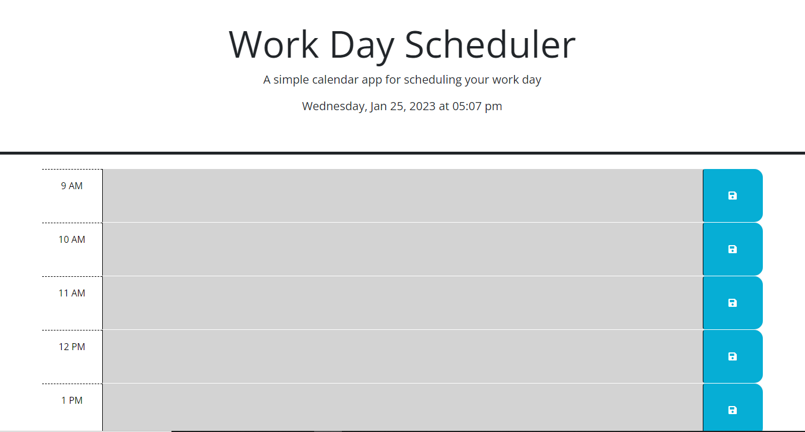

# Week 5 Challenge: Work Scheduler
## Description
The goal of this challenge was to add Javascript code to existing files to create functionality for a day scheduler app.
## The challenge of this Challenge
The challenging aspects of this assignment were to use dayJS to get a current date/time to be used both for display at the top and to check against in the planner to see if the current hour was past, present or future and to color the hour blocks accordingly. Also any entered tasks must the stored in the local storage and persist.
## Criteria Met
I was able to get the correct day/time to work with dayJS and to have the hour blocks color coded as they should be depending if they were in the past, present or future.  The save button got an event listener and was able to save the entered text in local storage.
## Link to Deployed Application

## Screenshot

## References
Used the MDN resource for help with the local storage: https://developer.mozilla.org/en-US/docs/Web/API/Window/localStorage
Got help with the day/time and finding the current hour at the dayJS site: https://day.js.org/docs/en/get-set/hour